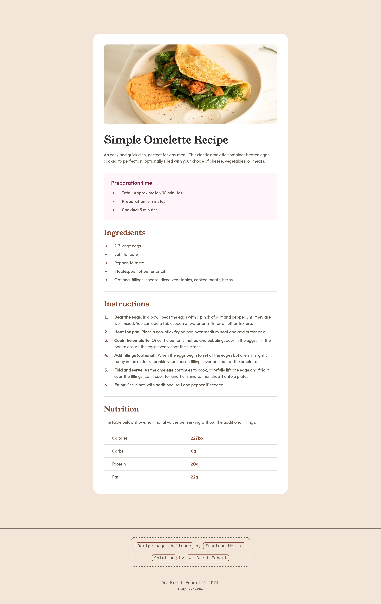

# Recipe page | Frontend Mentor Challenge

## Table of Contents

## Overview

This is a solution to the [Recipe page challenge on Frontend Mentor](https://www.frontendmentor.io/challenges/social-links-profile-UG32l9m6dQ). Frontend Mentor challenges help you improve your coding skills by building realistic projects. 

### About

This project creates a recipe page created as a solution to a Frontend Mentor challenge.

### Screenshots

#### Desktop

#### Mobile

### Links

- Live Site URL: [cg-fm-recipe-page.netlify.app](https://cg-fm-recipe-page.netlify.app/)
- Solution Repository URL: [github.com/crossinguard/fm-recipe-page](https://github.com/crossinguard/fm-recipe-page)

### Core Functionality

- Responsive design
- Semantic HTML
- Type safe

### Technology Used

- [Astro](https://astro.build/) - web framework
  - starting point: blank template
- HTML, CSS, TypeScript - coding languages
- [GitHub](https://github.com/) - git repository host
- [Netlify](https://www.netlify.com/) - web host platform

## Retrospection

### Design Process

### Status

### Lessons Learned

### References

- [Astro docs | components](https://docs.astro.build/en/basics/astro-components/) - component script vs component template
- [Astro docs | syntax](https://docs.astro.build/en/basics/astro-syntax/) - using variables within HTML and dynamic mapping

