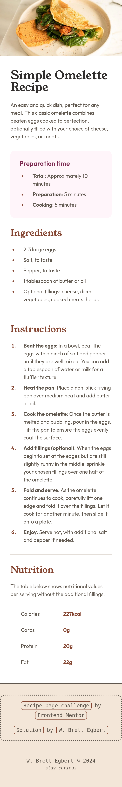

# Recipe page | Frontend Mentor Challenge

## Table of Contents

## Overview

This is a solution to the [Recipe page challenge on Frontend Mentor](https://www.frontendmentor.io/challenges/recipe-page-KiTsR8QQKm). Frontend Mentor challenges help you improve your coding skills by building realistic projects. 

### About

This project creates a recipe page as a solution to a Frontend Mentor challenge. The recipe page contains a card component featuring a feature recipe image, recipe overview (name, description, preparation details), and sections for ingredients, instructions, and nutrition information. The card components allows easy manipulation of the recipe information for each section by using human readable recipe data. 

### Screenshots

#### Desktop [1440px]


#### Mobile [375px]



### Links

- Live Site URL: [cg-fm-recipe-page.netlify.app](https://cg-fm-recipe-page.netlify.app/)
- Solution Repository URL: [github.com/crossinguard/fm-recipe-page](https://github.com/crossinguard/fm-recipe-page)

### Core Functionality

- Responsive design
- Semantic HTML
- Logical CSS properties
- Type safe

### Technology Used

- [Astro](https://astro.build/) - web framework
  - starting point: blank template
- HTML, CSS, TypeScript - coding languages
- [GitHub](https://github.com/) - git repository host
- [Netlify](https://www.netlify.com/) - web host platform


## Retrospection

### Design Process

I was working from a Figma design file, with specifications for both a desktop and mobile site. Aside from the `H1` heading representing the recipe name, all font sizes remained consistent between the two designs. Because of this I chose to approach this desktop-first. I started with a base card Astro component and added all information to a `recipe.json` file. My original intention was to read this data into my card, separating the recipe information from the recipe markup and presentation. As I worked I decided to work the information needed for each recipe section into the recipe section component itself rather than hosted in an external file. This meant the recipe image component houses information on the image, the instructions component houses all human-readable instructions, and so on for the other sections.

I built a primary recipe card separate helper components based on each section of the recipe.

```text
└── src/
    ├── components/
    |   ├── Card.astro
    |   ├── RecipeImage.astro
    |   ├── RecipeHeader.astro
    |   ├── Ingredients.astro
    |   ├── Instructions.astro
    |   └── Nutrition.astro
    └── pages/
        └── index.astro
```

I then built out the `Card.astro` primary component using my helper components. Each helper component contains its individual TypeScript, HTML, and CSS, with overall styles addressed on this primary card component or within `global.css`.

```html
<div class="card">
  <RecipeImage />
  <article class="recipe-text">
    <RecipeHeader />
    <Ingredients />
    <div class="thematic-break"></div>
    <Instructions />
    <div class="thematic-break"></div>
    <Nutrition />
  </article>
</div>
```

Additionally, I created utility classes based on the style guidelines for various elements used in the design. In an effort to minimize breakpoints, I used fluid typography to handle the `H1` sizing change from the mobile to the desktop size. Thanks [modern fluid typography editor!](https://modern-fluid-typography.vercel.app/). This tool not only makes it easy to understand when and over how long of a period my font will shift sizes, but it looks great while doing it.

```css
.heading-l {
  font-family: var(--font-family-fancy);
  font-size: 2.25rem;
  font-size: clamp(2.25rem, 1vw + 2rem, 2.5rem);
  color: var(--dark-charcoal);
  line-height: 1;
}
```

I used a similar approach with clamp to address the inline padding needed to meet both mobile and desktop specs. 

A goal of mine throughout all of my development is to minimize breakpoints, and with that try and not use media queries. I hit a few oddities on this one as I needed the mobile card to not have a border-radius, but wanted a border-radius on the desktop version. Additionally, the recipe image needed padding when on desktop but had to go edge-to-edge on mobile. I attempted a few variations of clamp, calc, min/max but was never happy with my solutions. Sometimes they worked but I didn’t feel they were intuitive. 

I pivoted and decided that clearly understood media queries were better than overly complex CSS workarounds requiring a master’s in math and several visual aids to understand. I pushed myself and tried out **container queries** for the first time. This shows up in my `RecipeImage.astro` component styles.

```css
<style>
  .image-container {
    container-type: inline-size;
    container-name: image;
  }
  @container image (width >= 41rem) {
    img {
      border-radius: 0.75rem;
      margin-block-start: 2.5rem;
    }
  }
</style>
```

While this does introduce a breakpoint where a fixed shift happens, it is based on the size of the image itself and should not do weird things with various screen sizes. Additionally, this minor shift does not have any oddities right before or after the breakpoint hits.

The only traditional media query I used was on the card itself. I had actually tried another container query but ended up spending more time than I wanted on troubleshooting odd resizing. During future extensions of this project I will try to adjust the media query into a container query.

### Status

I consider this page done (aside from the media query to container query future update) but plan on using this on personal projects. This specific recipe page is intentionally styled to match design specifications and text. For this future use, I plan to rewrite recipes for common approaches and units, something a bit difficult with using provided text. The hope is to use number values and strings so I can add features like recipe doubling. Additionally, I will use this recipe component collection for many recipes within an Astro content collection. For that I will adapt each of my components to be fed their information through props rather than being hard baked into each component as constants. 

### Lessons Learned

Container queries! This are some hot new thing I am hearing about but hadn’t used them yet. My goal is still to not use any breakpoints but container queries seem like a great middle ground for when that gets tricky.

Additionally, while I have used constants in my component frontmatter in prior projects, I am still getting used to it. This project gave me great practice iterating over json arrays while ensuring type safety. This work will pay off when I make these prop-based.


### References

- [Astro docs | components](https://docs.astro.build/en/basics/astro-components/) - component script vs component template
- [Astro docs | syntax](https://docs.astro.build/en/basics/astro-syntax/) - using variables within HTML and dynamic mapping
- [Modern fluid typography editor](https://modern-fluid-typography.vercel.app/) -  typography resizing using clamp instead of breakpoints! 
- [MDN | CSS container queries](https://developer.mozilla.org/en-US/docs/Web/CSS/CSS_containment/Container_queries) - reference on using container queries


